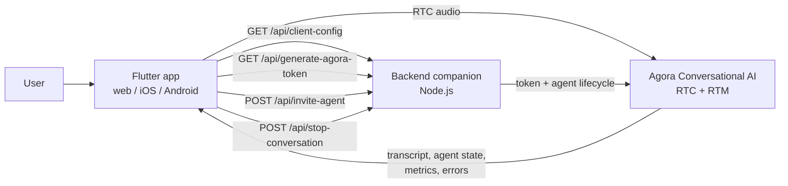
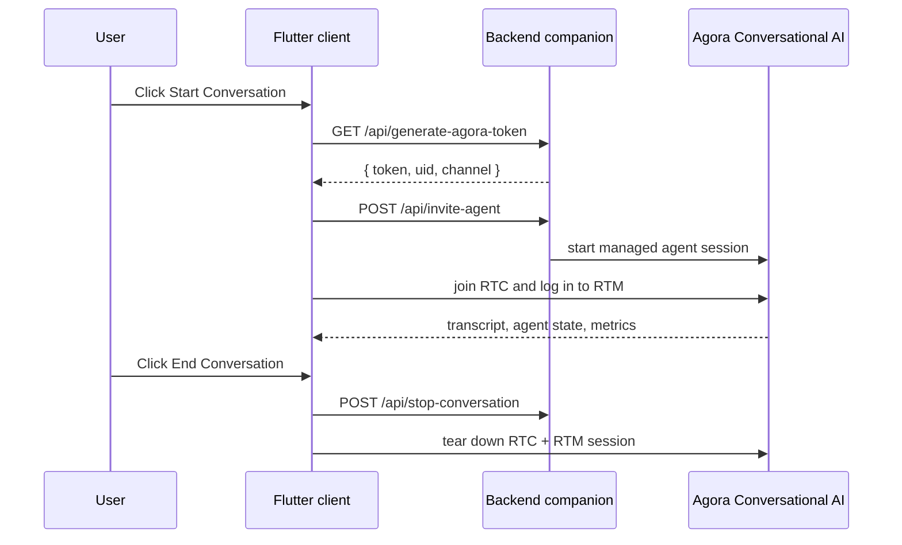

# Agora Conversational AI Flutter Quickstart

Build a production-style voice agent in Flutter with the Agora Conversational AI Engine, including live transcript, agent state, and real-time call control.

## Prerequisites

- [Flutter](https://flutter.dev/docs/get-started/install)
- [Dart](https://dart.dev/get-dart)
- [Node.js 22+](https://nodejs.org/)
- [npm](https://www.npmjs.com/) or another Node package manager
- [Agora CLI](https://github.com/AgoraIO-Community/cli)
- An Agora project with Conversational AI enabled

## Run It

Getting started is quick and easy: install the Agora CLI, bind your project, write the local env file, start the backend companion, and run the Flutter client.

1. **Install the Agora CLI and sign in**
   - skip this step if `agora` is already on your PATH

   ```bash
   curl -fsSL https://raw.githubusercontent.com/AgoraIO/cli/main/install.sh | sh -s -- --add-to-path
   agora login
   ```

2. **Bind the project and write local config**

   ```bash
   agora project use <your-project>
   agora project env write .env.local
   ```

3. **Start the backend companion**

   ```bash
   cd backend && npm install && npm run dev
   ```

4. **Run the Flutter client**

   In a second terminal from the repo root:

   ```bash
   flutter pub get
   flutter run -d chrome
   ```

   Chrome uses `http://localhost:3001` by default. Android emulators use `http://10.0.2.2:3001`. Override the backend URL with `--dart-define=BACKEND_BASE_URL=...` if you need a different host.

5. Open the app in the target platform and click **Start Conversation**.

If the agent does not join or transcripts do not appear, run `agora project doctor --deep` to check credentials, feature enablement, network reachability, and local env binding.

## Working from a clone of this repository

Use this path if you already cloned this repo and want to develop directly from it:

```bash
git clone <your-fork-or-local-repo-url>
cd agent-quickstart-flutter
agora login
agora project use <your-project>
agora project env write .env.local
agora project doctor --deep
cd backend && npm install && npm run dev
flutter pub get
flutter run -d chrome
```

## Environment Variables

The repo-root [`.env.local`](./.env.local) file is the single runtime config source for the backend companion. The Flutter client loads its public config from the backend companion at startup.

| Variable | Required | Default | Notes |
| --- | ---: | ---: | --- |
| `NEXT_PUBLIC_AGORA_APP_ID` | ✅ | — | Agora Console project App ID used by the backend token route and exposed to the Flutter client through the backend companion. |
| `NEXT_AGORA_APP_CERTIFICATE` | ✅ | — | Agora Console project App Certificate. The backend reads it from the same root `.env.local` file. |
| `NEXT_PUBLIC_AGENT_UID` |  | `123456` | Must match the managed agent uid used by the backend invite flow. |
| `NEXT_AGENT_GREETING` |  | — | Optional override for the agent opening line. |
| `BACKEND_BASE_URL` |  | `http://localhost:3001` on web, `http://10.0.2.2:3001` on Android emulator | Flutter client backend companion URL. |

The default agent configuration uses Agora-managed STT, LLM, and TTS, so no extra vendor API keys are required for the base quickstart.

> **Default vs BYOK** - the quickstart ships with Agora-managed inference first. Bring your own provider keys later only if you need custom model or vendor selection.

## Commands

```bash
# Dev
cd backend && npm run dev      # start the backend companion
flutter run -d chrome          # run the Flutter app in Chrome

# Quality
flutter analyze                # static analysis
flutter test                   # unit and widget tests

# Project setup
agora project doctor --deep
```

Run the narrowest relevant checks before you ship a change.

## Architecture



The Flutter client joins Agora RTC for audio transport and uses a backend companion to mint short-lived tokens and start or stop the managed agent session. Live transcript, agent state, and call diagnostics arrive over RTM, with the web target loading the Agora RTM web SDK through [`web/index.html`](./web/index.html).

## Conversation Flow



## What You Get

- Flutter voice client for web, iOS, and Android
- RTC audio plus session state and call-control UI
- backend routes for token generation, invite, and stop
- live connection status, event log, and call-state UI
- Agora-managed default STT, LLM, and TTS configuration

## How It Works

1. The client requests a short-lived token from the backend.
2. The backend invites the Agora managed agent for the selected channel.
3. The Flutter app joins the RTC channel and publishes microphone audio.
4. The client receives live session events, transcript updates, and agent state in the call UI.
5. On end, the client calls the stop flow and tears down the call view cleanly.

## Optional BYOK

The base quickstart defaults to Agora-managed inference. If we add BYOK support later, the docs will list the provider-specific environment variables here.

## Repo Map

- [`lib/main.dart`](./lib/main.dart) - Flutter app shell and entry point
- [`lib/services/backend_api.dart`](./lib/services/backend_api.dart) - client API wrapper for the backend companion
- [`lib/services/conversation_session_controller.dart`](./lib/services/conversation_session_controller.dart) - session lifecycle, RTC, and RTM coordination
- [`backend/`](./backend/) - Node backend companion for token, invite, and stop routes
- [`web/index.html`](./web/index.html) - web bootstrap that loads the Agora RTC and RTM browser SDKs
- [`docs/ai/`](./docs/ai/) - progressive-disclosure docs for agents
- [`AGENTS.md`](./AGENTS.md) - primary agent-facing guide
- [`android/`](./android/) - Android host app
- [`ios/`](./ios/) - iOS host app

## Troubleshooting

- **Agent does not join or transcripts are missing:** run `agora project doctor --deep`.
- **Setup feels incomplete:** make sure the project is bound and local env values are written.
- **Voice or state flow is missing:** confirm the backend token and invite flow are implemented, the backend companion is running, and microphone permission is granted.
- **Chrome shows no transcript:** make sure `web/index.html` loads the Agora RTM web SDK and `web/rtm_bridge.js` is present.
- **Android cannot reach the backend:** use `http://10.0.2.2:3001` for the emulator, or point `BACKEND_BASE_URL` at your machine's LAN IP when using a physical device.

## More Docs

- [docs/ai/L0_repo_card.md](./docs/ai/L0_repo_card.md)
- [docs/ai/RECIPE.md](./docs/ai/RECIPE.md)
- [AGENTS.md](./AGENTS.md)

## Security

Please do not open public issues for security reports. Use the appropriate Agora security contact path with details and reproduction steps.
